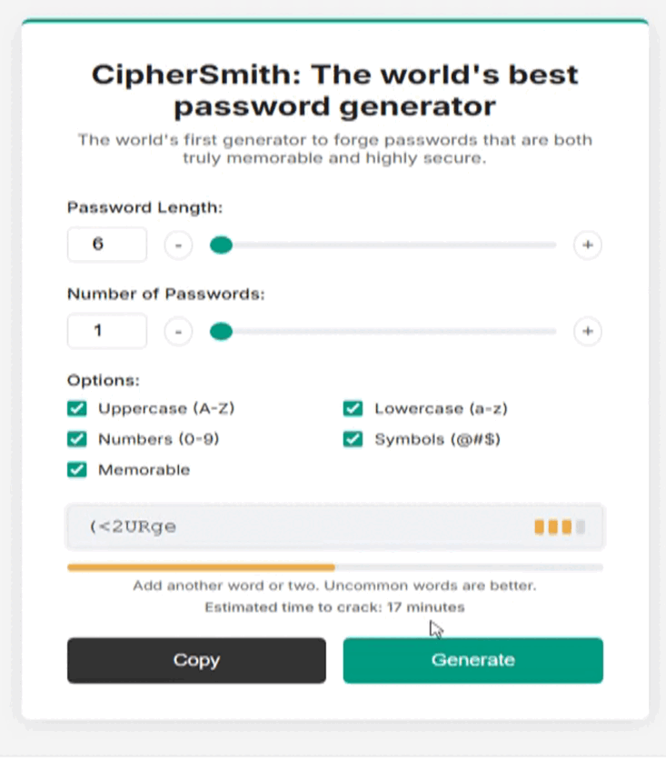

```
   _____ _       _               _____           _ _   _     
  / ____(_)     | |             / ____|         (_) | | |    
 | |     _ _ __ | |__   ___ _ _| (___  _ __ ___  _| |_| |__  
 | |    | | '_ \| '_ \ / _ \ '__\___ \| '_ ` _ \| | __| '_ \ 
 | |____| | |_) | | | |  __/ |  ____) | | | | | | | |_| | | |
  \_____|_| .__/|_| |_|\___|_| |_____/|_| |_| |_|_|\__|_| |_|
          | |                                                
          |_|                                                                                                  
```
# CipherSmith 🔑✨


Welcome to CipherSmith, the world's first generator designed to forge passwords that are both **truly memorable and highly secure**, without sacrificing your length requirements.

<p align="center">
  
</p>

---
### 📂 File Structure

CipherSmith/
├── LICENSE           # The important legal stuff (MIT License)
├── README.md         # You are here! The project's manual 👋
├── index.html        # The main application file (The stage)
├── script.js         # The core logic and magic (The wizard behind the curtain)
├── qrcode.jpg        # The aesthetic stuff (BTC donation QR code)
├── 1.0/              # Archived & obsolete files from v1.0
│   └── ...
└── 2.0/              # Archived & obsolete files from v2.0
└── ...

### 🤔 Our Philosophy: Not Your Average Passphrase Generator

Let's get one thing straight: CipherSmith is **not** a passphrase generator.

Traditional passphrase tools give you a string of words, and you're stuck with whatever length that creates. We thought that was... well, annoying. CipherSmith is different. Our "Memorable" mode intelligently builds a password from a massive wordlist that **perfectly fits the character length you need**, then cleverly sprinkles in numbers and symbols. The result? A password you can actually remember that still meets those pesky "must be 16 characters long" requirements. It's the best of both worlds!

---

### 🎉 Features

* **🛡️ Cryptographically Secure:** We use `window.crypto` for all random generation. No `Math.random()` nonsense here! Your passwords are as unpredictable as they get.
* **🧠 Two Modes, One Generator:**
    * **Random Mode:** For classic, brute-force-proof gibberish.
    * **Memorable Mode:** Our special sauce! Creates easy-to-recall passwords at *any* length.
* **💪 Live Strength Analysis:** See how tough your new password is in real-time with an integrated `zxcvbn` strength meter. Get instant feedback and time-to-crack estimates!
* **👮 Security Gate:** We've added a friendly bouncer at the door that ensures you're using at least 3 character types, nudging you toward better security habits.
* **🎨 Polished & Intuitive UI:** Clean, responsive, and easy on the eyes. Generating passwords is now a pleasure, not a chore.
* **🌍 Works Offline:** Once the page is loaded, you can disconnect. All generation happens right in your browser for maximum privacy.

---

### 💻 Tech Stack

* **Vanilla HTML5**
* **Vanilla CSS3**
* **Vanilla JavaScript (ES6+)**
* **zxcvbn.js** for strength estimation

---

### 🚀 How to Use

#### Direct Access (Easiest Way) 🖱️

Simply click the link below to use CipherSmith directly in your browser, powered by GitHub Pages:

👉 **[Use CipherSmith Now!](https://besttoolsforever.github.io/CipherSmith/index.html)**

#### Local Use (For Developers) 💻

If you want to run the project on your own machine:

1.  Clone or download this repository.
2.  Open the `index.html` file in your favorite browser.
3.  That's it! Start forging some awesome passwords.
 
---

### 🤝 Contributing

Got an idea? Found a bug? Feel free to open an issue or submit a pull request! All contributions are welcome. Let's make CipherSmith even better together.

---

### ❤️ Support the Project

This is an open-source project created with love. If CipherSmith has saved you from password headaches, consider supporting its future development!

**Support with ₿itcoin:** `bc1qufnkjqtzckfqlqsakpv3yjjyg0gce2674wdhv04fmjw635vuj9zsgrzuwp`

---

### 📜 License

This project's source code is licensed under the MIT License. See the `LICENSE` file for details. Note that third-party components have their own licenses as described below.

---

### 🙏 Acknowledgements & Third-Party Magic ✨

CipherSmith is a powerful tool, and its strength comes from standing on the shoulders of giants. Here's a shout-out to the amazing projects that make our password-forging magic possible!

#### The Wordlist & Its License 🧠

Our "Memorable" mode is powered by the fantastic **[Google 10,000 English words list](https://github.com/first20hours/google-10000-english)** curated by `first20hours`.

It's important to know that this data file has a custom license that recommends it for educational and personal use, but advises against commercial use. Therefore, **if you plan to modify, redistribute, or sell a product based on CipherSmith, we strongly recommend you replace the wordlist** with one that has a clear commercial license.

And don't worry, if you're offline or GitHub is taking a nap, we've got a built-in local fallback list so CipherSmith is always ready to go. Offline-first for the win! 🏆

#### The Strength Meter 💪

Ever wonder how we calculate that "time to crack"? That's the incredible work of the **[zxcvbn library](https://github.com/dropbox/zxcvbn)** from Dropbox, which is distributed under the permissive **MIT License**.

This powerful library goes way beyond simple character counting to give you a realistic estimate of your password's strength. It's the reason our feedback is so smart!

A huge thank you to these developers for sharing their work with the world! ❤️
