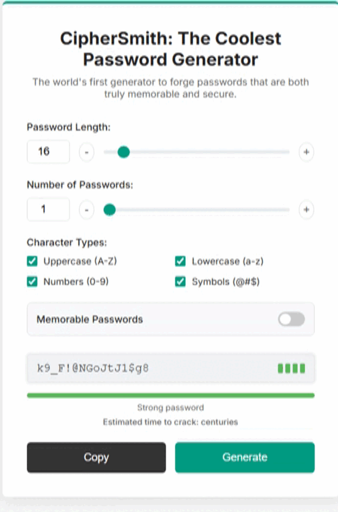

# CipherSmith 🔑✨
```
   _____ _       _               _____           _ _   _     
  / ____(_)     | |             / ____|         (_) | | |    
 | |     _ _ __ | |__   ___ _ _| (___  _ __ ___  _| |_| |__  
 | |    | | '_ \| '_ \ / _ \ '__\___ \| '_ ` _ \| | __| '_ \ 
 | |____| | |_) | | | |  __/ |  ____) | | | | | | | |_| | | |
  \_____|_| .__/|_| |_|\___|_| |_____/|_| |_| |_|_|\__|_| |_|
          | |                                                
          |_|                                                                                                  
```


**Welcome to CipherSmith, the world's first password generator designed to create truly easy-to-remember and secure passwords, without compromising on length.**

<p align="center">
  
</p>

---
### 📂 File Structure

```
├── dwyl-english-words/ # The English wordlist source files
│   ├── LICENSE.md      # License for the original dwyl/english-words repository
│   ├── README.md       # Explains the wordlist's origin and its use
│   └── words_alpha.txt # The local wordlist file used by the script
├── images              # The aesthetic stuff (UI graphics & donation QR code)
├── lib/                # Third-party libraries
│   └── zxcvbn.js       # The zxcvbn strength estimation library
├── CipherSmith.gif     # Animated GIF showing the generator in action
├── LICENSE             # The important legal stuff (MIT License)
├── README.md           # You are here! The project's manual 👋
├── index.html          # The main application file (The stage) and landing page
├── script.js           # The core logic and magic (The wizard)
└── style.css           # The visual style (The wardrobe)
```
### 🤔 Why CipherSmith Exists

The Problem
Most password generators focus solely on complexity, producing strings that may be secure but nearly impossible to remember. This becomes a nightmare in real-life situations: losing your phone, setting up Wi-Fi on a new device, or typing a password by hand during an emergency.

The Proposal
CipherSmith was built to balance both worlds: security and usability. It generates passwords strong enough to protect sensitive accounts, yet simple enough to type quickly when needed.

The Principle
The core idea is straightforward: passwords shouldn’t just be safe—they should also be practical for everyday use.

For those who prioritize maximum security and privacy, the 'Easy-to-Remember Passwords' mode can be easily disabled. You’ll still enjoy a powerful, open-source password generator, and our Google Chrome extension offers a convenient and reliable assistant for managing your credentials.

---
### 🎯 What This Tool Is (and Isn't)
To ensure clarity, it's important to understand what CipherSmith is designed for, and what it is not.

What It Is: ✅

A local, simple, and reliable password generator.

A tool focused on usability and convenience without sacrificing security.

What It Isn't: ❌

A password manager. CipherSmith does not store, save, or manage passwords in any way.

A multi-word passphrase creator (like "correct-horse-battery-staple").

### ⚙️ Total Flexibility
•Customizable Settings: Adjust the password length (default: 16 characters), character types (uppercase, lowercase, numbers, symbols), and the assistant icon size (small, medium, or large).

•Your preferences are saved for the next use.

•Customizable Dictionary: Replace the default dictionary (...\ciphersmith-extension\dwyl-english-words\words_alpha.txt) with your own, keeping the format of one word per line.

•Icon Disabling: A button in the popup allows you to disable the assistant icon until it's needed again.
### 📚 A Note on Wordlists for 'Easy-to-Remember Passwords' Mode 

The 'Easy-to-Remember Passwords' mode relies on a robust list of English words. To ensure both quality and reliability, CipherSmith uses a three-tiered approach:

🌐 Online Source (Primary): The generator first attempts to fetch the comprehensive Google 10,000 English words list from its online source for the highest quality word base.

📦 Local Fallback (Secondary): If the online request fails (e.g., you're offline), it seamlessly falls back to loading a large wordlist from the local dwyl-english-words/words_alpha.txt directory included in this project.

⚙️ Built-in Fallback (Final Resort): As a final guarantee, a small, hardcoded list of words is included directly in the script. This ensures core functionality even if the other files are missing. Note: Due to its limited size, this fallback list is not recommended for generating passwords for real-world use and is intended for functionality assurance only.

**A Note on the Chrome Extension Version:** For maximum privacy and offline reliability, the browser extension version uses **only** the local `words_alpha.txt` dictionary. It does not fetch online lists or require the other fallbacks, as the dictionary is bundled directly with the extension.

---

### 🎉 Features

* **🛡️ Cryptographically Secure:** We use `window.crypto` for all random generation.
* **Two Modes, One Generator:**
    * **Random Mode:** For classic, brute-force-proof gibberish.
    * **Easy-to-Remember Passwords Mode:** Our special sauce! Creates easy-to-recall passwords at *any* length.
* **💪 Live Strength Analysis:** See how tough your new password is in real-time with an integrated `zxcvbn` strength meter. Get instant feedback and time-to-crack estimates!
* **👮 Security Gate:** We've added a friendly bouncer at the door that ensures you're using at least 3 character types, nudging you toward better security habits.
* **🎨 Polished & Intuitive UI:** Clean, responsive, and easy on the eyes. Generating passwords is now a pleasure, not a chore.
* **🌍 Works Offline:** Once the page is loaded, you can disconnect. All generation happens right in your browser for maximum privacy.

---

### 💻 Tech Stack

* **Vanilla HTML5**
* **Vanilla CSS3**
* **Vanilla JavaScript (ES6+)**
* **zxcvbn.js** for strength estimation

---

### 🚀 How to Use

#### 1. Direct Web Access 🌐

Simply click the link below to use CipherSmith directly in your browser, powered by GitHub Pages:

👉 **[Use CipherSmith Now!](https://besttoolsforever.github.io/CipherSmith/index.html)**

#### 2. Google Chrome Extension 🧩
Integrate CipherSmith directly into your workflow. The extension allows you to open the full generator from its pinned icon or use it as an assistant that appears directly in password fields during account registration, offering seamless compatibility with most websites.

👉 **[Get the Chrome Extension Now!](https://chromewebstore.google.com/detail/bbccnjfcpepahpfcbppgembfdfgcmdjl/)**

#### 3. Local Use (For Developers) 💻

If you want to run the project on your own machine:

1.  Clone or download this repository.
2.  Open the `index.html` file in your favorite browser.
3.  That's it! Start forging some awesome passwords.
 
---

### 🤝 Contributing

Got an idea? Found a bug? Feel free to open an issue or submit a pull request! All contributions are welcome. Let's make CipherSmith even better together.

---

### ❤️ Support the Project

This is an open-source project created with love. If CipherSmith has saved you from password headaches, consider supporting its future development!

**Support with ₿itcoin:** `bc1qufnkjqtzckfqlqsakpv3yjjyg0gce2674wdhv04fmjw635vuj9zsgrzuwp`

---

### 📜 License

This project's source code is licensed under the MIT License. See the `LICENSE` file for details. Note that third-party components have their own licenses as described below.

---

### 🙏 Acknowledgements & Third-Party Magic ✨

CipherSmith is a powerful tool, and its strength comes from standing on the shoulders of giants. Here's a shout-out to the amazing projects that make our password-forging magic possible!

#### The Wordlist & Its License 

Our "Easy-to-Remember Passwords" mode is powered by the fantastic **[Google 10,000 English words list](https://github.com/first20hours/google-10000-english)** curated by `first20hours`.

The local fallback list is provided by the `dwyl` **[List Of English Words A text file containing over 466k English words.](https://github.com/dwyl/english-words)** repository, which is graciously licensed under the Unlicense, making it free for all use cases. Thanks `dwyl` in advance.

It's important to know that this data file has a custom license that recommends it for educational and personal use, but advises against commercial use. Therefore, **if you plan to modify, redistribute, or sell a product based on CipherSmith, we strongly recommend you replace the wordlist** with one that has a clear commercial license.

And don't worry, if you're offline or GitHub is taking a nap, we've got a built-in local fallback list so CipherSmith is always ready to go. Offline-first for the win! 🏆

#### The Strength Meter 💪

Ever wonder how we calculate that "time to crack"? That's the incredible work of the **[zxcvbn library](https://github.com/dropbox/zxcvbn)** from Dropbox, which is distributed under the permissive **MIT License**.

This powerful library goes way beyond simple character counting to give you a realistic estimate of your password's strength. It's the reason our feedback is so smart!

A huge thank you to these developers for sharing their work with the world! ❤️

#### 🃏 Philosophical Notes on Passwords
“You do not choose the password—the password chooses you.” – **An allusion to Plato's Myth of Reminiscence.**

“True security does not exist because all knowledge is, by nature, incomplete.” – **Inspired by Karl Popper's ideas on the fallibility of knowledge.**

“True security lies not in the complexity of the key, but in the uncertainty of its location.” – **A thought derived from Heisenberg's Uncertainty Principle.**

“And if you gaze for long into the generated passwords, they will certainly gaze back into you.” – **Inspired by Friedrich Nietzsche.**
